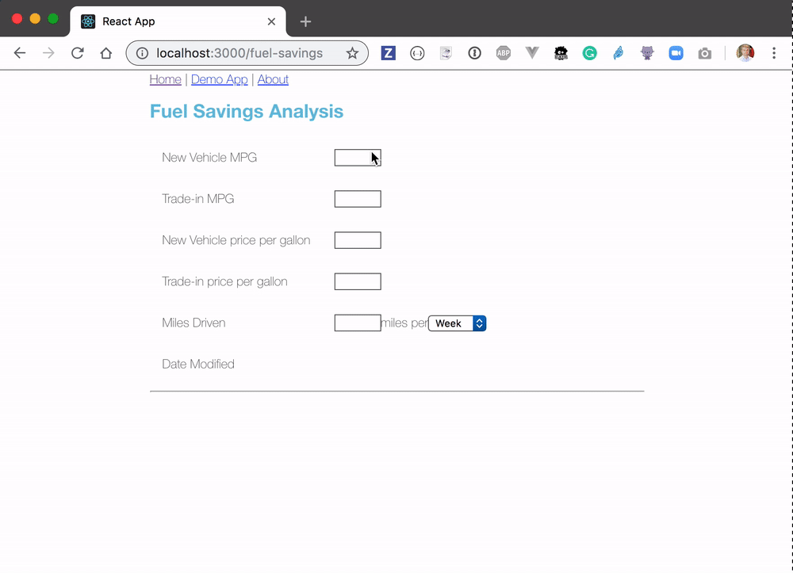
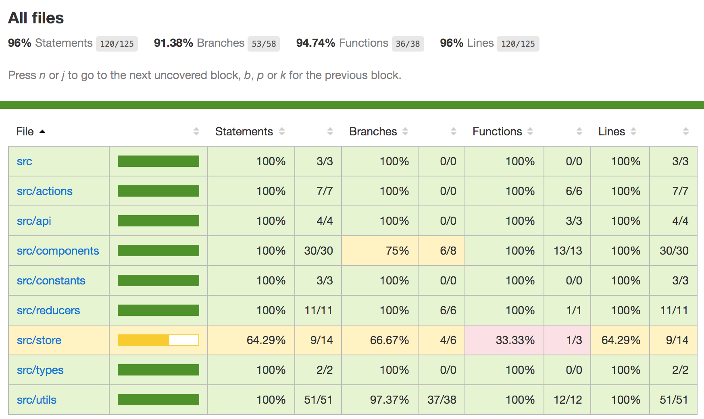

# Testing Demo App - This project is clone of https://github.com/bahmutov/testing-react.git

Goal is to publish jest + cypress combined code coverage in sonar

This project was bootstrapped with [Create React App v3](https://github.com/facebookincubator/create-react-app).



# Quick Start

```
npm install
npm start
```

The above commands will install dependencies and start the app. To run tests, run `npm test` on a separate command line. There are no tests written in the master branch.

**Tip:** to start the application and the mock API and open Cypress, you can use [start-server-and-test](https://github.com/bahmutov/start-server-and-test) utility.

```shell
npm run dev
```

## Testing libraries

This instance of create-react-app has been enhanced with the following testing libraries:

| Library                 | Description                                                                        |
| ----------------------- | ---------------------------------------------------------------------------------- |
| Jest                    | Automated testing                                                                  |
| Enzyme                  | Unit test React components in isolation via `shallow` or with children via `mount` |
| enzyme-adapter-react-16 | Configures enzyme to work with React 16                                            |
| react-test-renderer     | Render React components to JSON for snapshot testing                               |
| redux-mock-store | Mock store for testing your redux async action creators and middleware |
| Cypress                 | In browser integration testing via Mocha and Chai                                  |

## Complete code coverage with Cypress

When you run the application with `npm start` it instruments the source code using [@cypress/instrument-cra](https://github.com/cypress-io/instrument-cra) module. The code coverage is collected using [@cypress/code-coverage](https://github.com/cypress-io/code-coverage) plugin and saved in `coverage` folder.



### Installation

**Important:** your application should have been created using CRA v3 and include `react-scripts` v2+.

First, add NPM module [@cypress/instrument-cra](https://github.com/cypress-io/instrument-cra) as a dev dependency

```shell
npm install --save-dev @cypress/instrument-cra
```

Load this module when starting the application in `package.json`

```json
{
  "scripts": {
    "start": "react-scripts -r @cypress/instrument-cra start"
  }
}
```

Your application's source code should be instrumented when you run `npm start`. Then you can use [@cypress/code-coverage](https://github.com/cypress-io/code-coverage) plugin to run Cypress tests and save code coverage reports.

## See more

For more details about code coverage, see
- [Cypress code coverage guide](https://on.cypress.io/code-coverage)
- [Complete code coverage with Cypress](https://www.cypress.io/blog/2019/08/08/webcast-recording-complete-code-coverage-with-cypress/) webinar

## Docker commands

### Using cypress/included:6.2.1 docker image

#### command to check cypress and browser info
```
docker run -it -v <absolutePath>/testing-react:/e2e -w /e2e --entrypoint=cypress cypress/included:6.2.1 info
```

#### command to execute cypress e2e with chrome browser
```
docker run -it -v C:/Users/nkumarpa/workspace/testing-react:/e2e -w /e2e cypress/included:6.2.1 --browser chrome
```